# TFM — Taiku File Manager

[](https://github.com/taiku666/tfm/actions/workflows/ci.yml)

A dual-panel terminal file manager written in C, built for
Omarchy/Hyprland. Ships **two front-ends that share one core**: a
dependency-free terminal UI, and an optional GTK4/libadwaita GUI that
follows your Omarchy theme automatically.

**USE AT YOUR OWN RISK - THIS SW IS STILL IN EARLY STAGE

> Built with AI — this project was developed with the help of Claude Code.

<p align="center">
  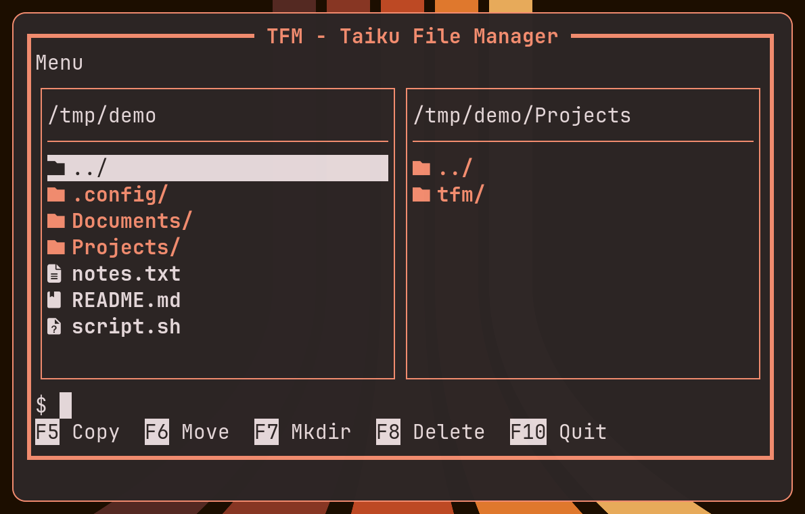
  &nbsp;&nbsp;
  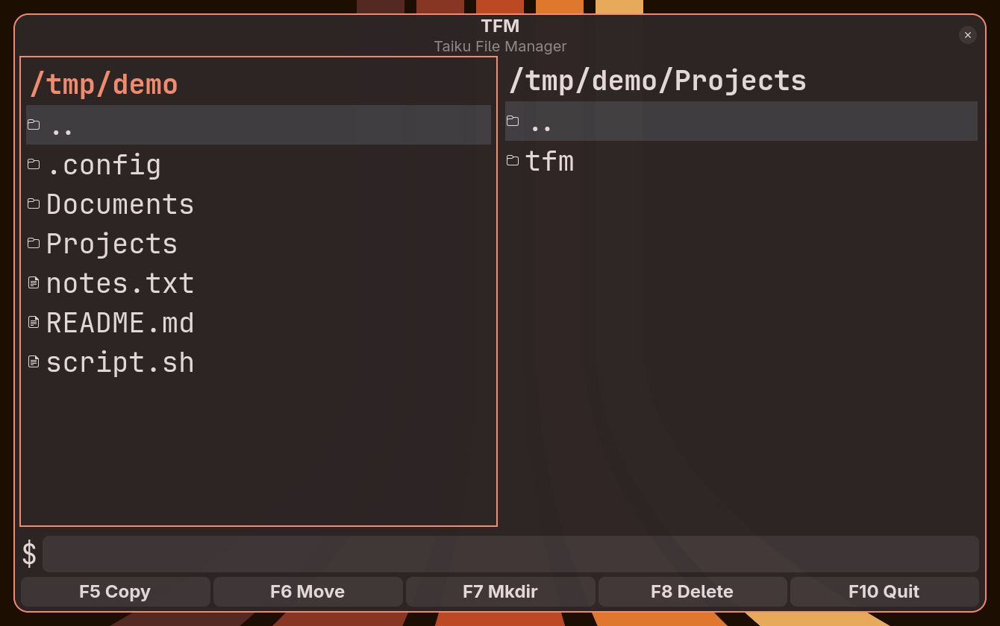
</p>
<p align="center"><em>Left: <code>tfm</code> in the terminal. Right: <code>tfm-gui</code>, both themed by the same live Omarchy accent color.</em></p>

## Features

- **Dual-panel browsing** with full keyboard navigation, in both front-ends.
- **File operations** — copy, move, delete, create folder/file, rename —
  with live progress reporting and Skip/Overwrite/Abort prompts on
  conflicts.
- **Recoverable delete** — F8 moves to the freedesktop.org trash (the
  same one GNOME Files/Dolphin use) instead of deleting outright; F9
  (or Ctrl+Z in the GUI) undoes the most recent one. Shift+F8 bypasses
  the trash for a real, permanent delete.
- **Built-in editor launch** (`$EDITOR`) for text files, by extension.
- **Command shell bar**, with `cd` support in both front-ends.
- **Persisted configuration** (`tfm.ini`): last-visited directory per panel,
  restored on startup.
- **Full UTF-8 support** for filenames and display.
- **Live Omarchy theming** in the GUI — reads the active theme's
  `colors.toml` and re-themes instantly on theme change via a hook.

<p align="center">
  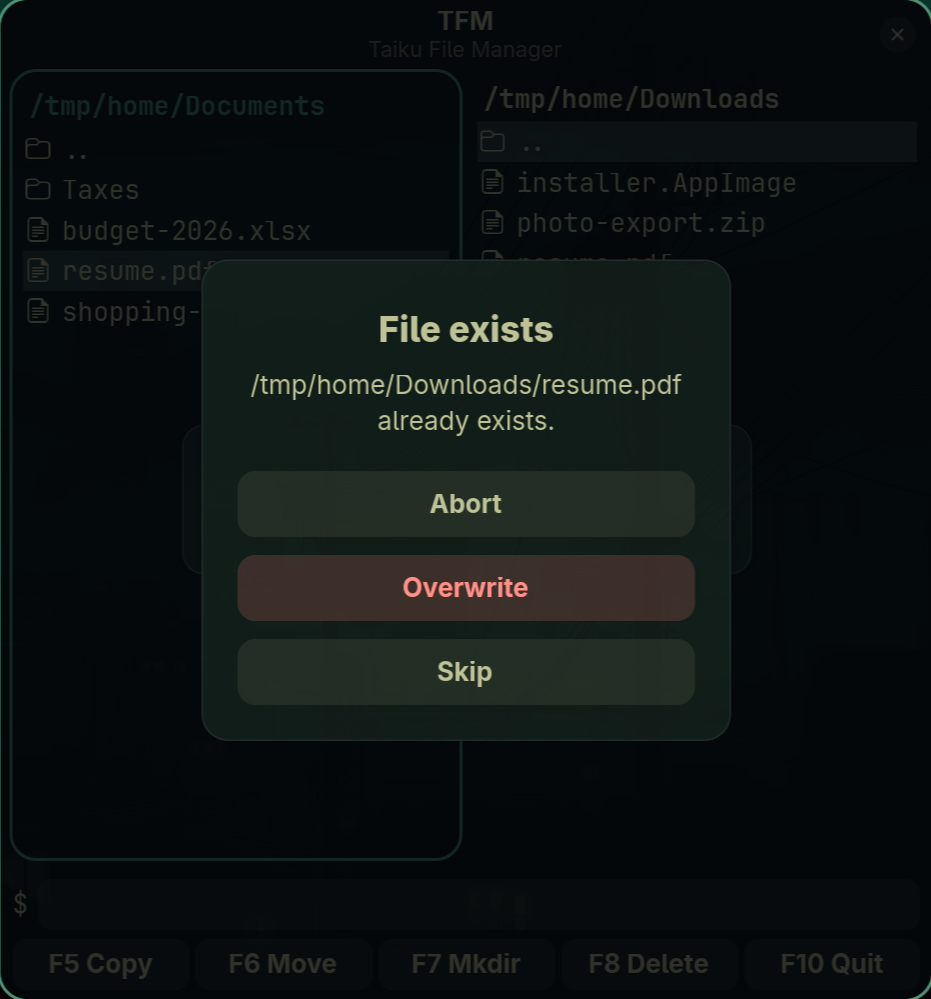
</p>
<p align="center"><em>Every destructive operation — copy, move, delete — confirms before it overwrites anything.</em></p>

## Theme gallery

Both front-ends pick up the active [Omarchy](https://omarchy.org) theme live —
no restart needed. A few examples:

<p align="center">
  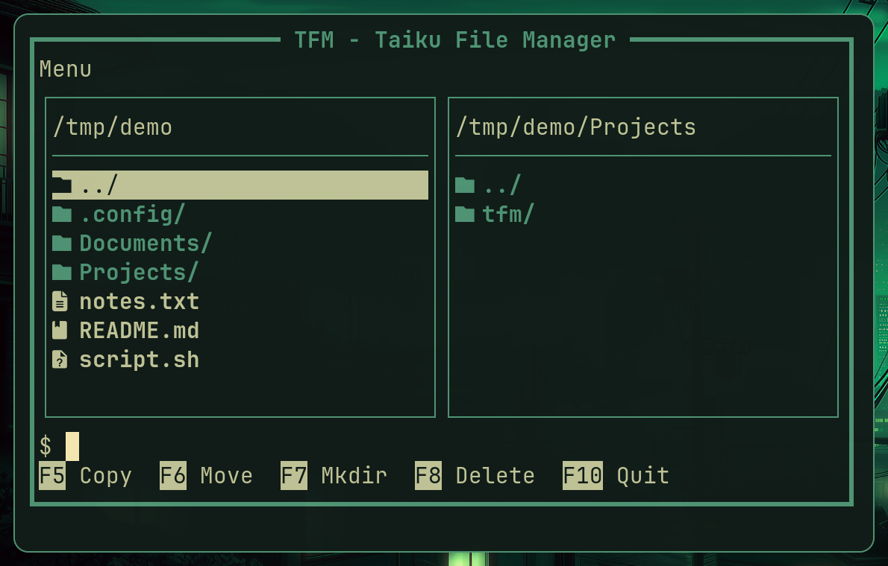
  &nbsp;&nbsp;
  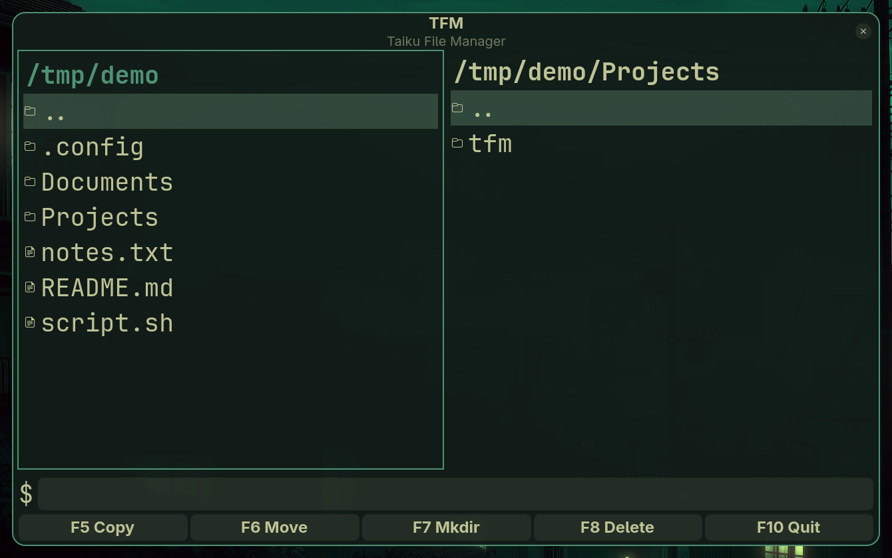
</p>
<p align="center"><em>Osaka Jade</em></p>

<p align="center">
  
  &nbsp;&nbsp;
  
</p>
<p align="center"><em>Ristretto</em></p>

<p align="center">
  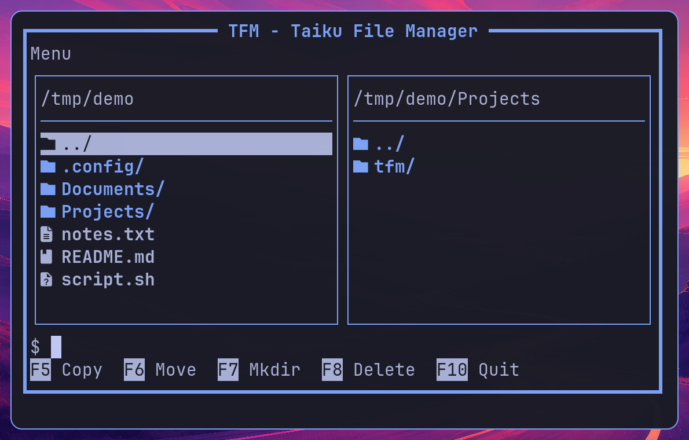
  &nbsp;&nbsp;
  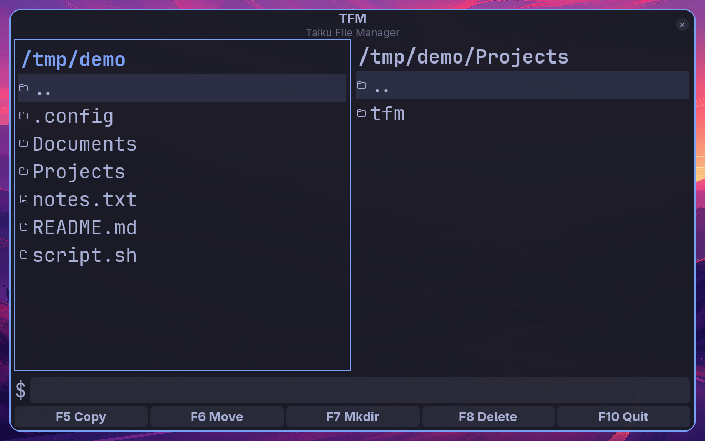
</p>
<p align="center"><em>Tokyo Night</em></p>

<p align="center">
  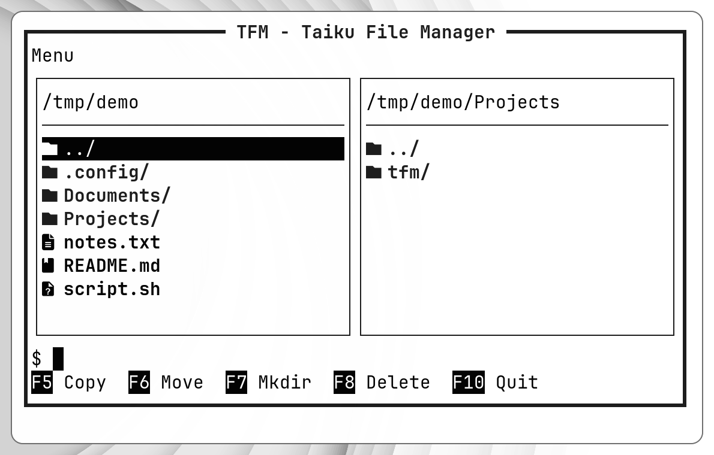
  &nbsp;&nbsp;
  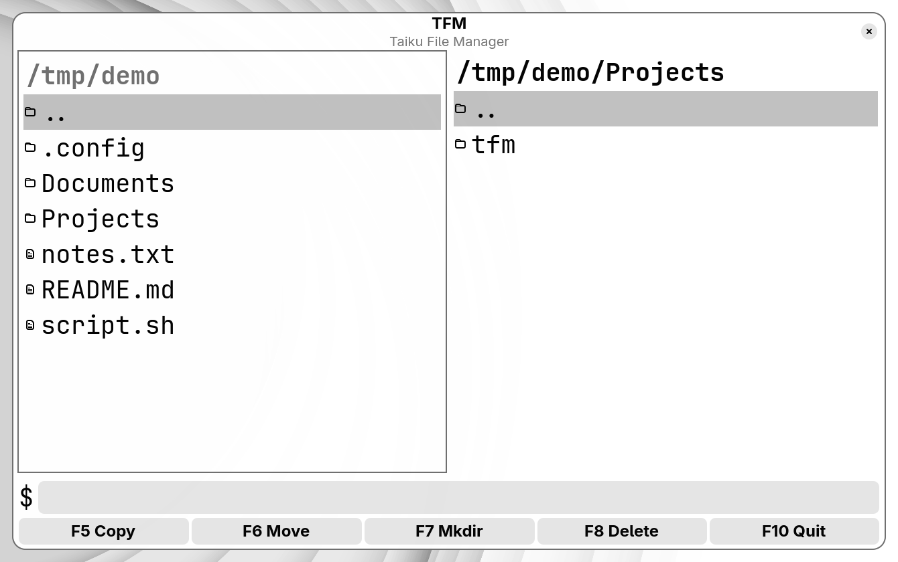
</p>
<p align="center"><em>White</em></p>

<p align="center">
  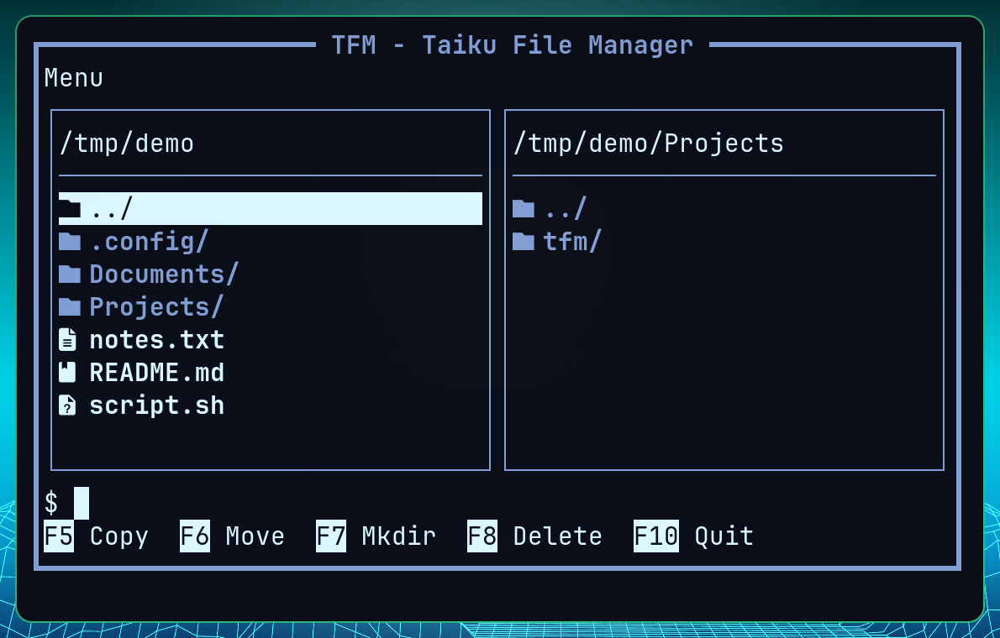
  &nbsp;&nbsp;
  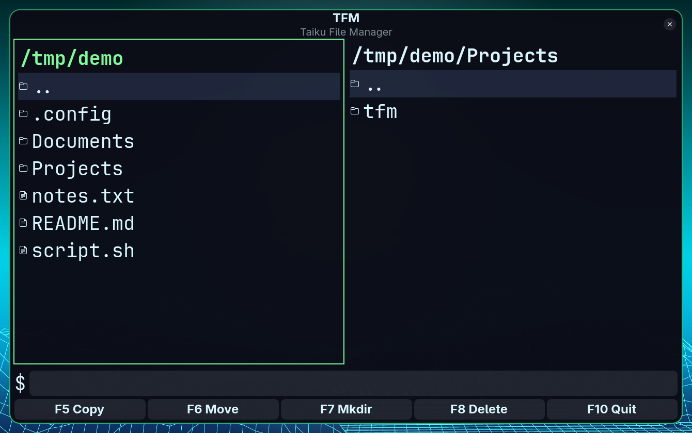
</p>
<p align="center"><em>Hackerman</em></p>

## Requirements

| | Terminal UI (`tfm`) | GUI (`tfm-gui`, optional) |
|---|---|---|
| OS | Linux | Linux |
| Toolchain | GCC, GNU Make | GCC, GNU Make |
| Libraries | *none* | GTK4, libadwaita |

## Building

```sh
make          # builds tfm — terminal UI only, zero external deps
make tfm-gui  # builds tfm-gui — checks for GTK4/libadwaita first
```

## Running

```sh
./bin/tfm
./bin/tfm-gui
```

## Installing

```sh
make install                 # installs tfm to $PREFIX/bin (default /usr/local/bin)
make install-gui              # installs tfm-gui
make install-gui-theme-hook   # installs the Omarchy theme-change hook for tfm-gui
```

`PREFIX` can be overridden, e.g. `make install PREFIX=$HOME/.local`.

### Prebuilt binaries

Each [release](https://github.com/taiku666/tfm/releases) also attaches
prebuilt `tfm`/`tfm-gui` binaries. They're built on one x86-64
Arch/Omarchy machine and dynamically linked against its system
glibc/GTK4/libadwaita — they're not statically linked or
cross-compiled, so they aren't guaranteed to run on other distros or
older library versions. Building from source (above) is the reliable
path; the prebuilt binaries are a convenience, not a portable release
artifact.

## Project structure

```
tfm/
├── Makefile
├── README.md
├── src/          # terminal UI + shared core
├── src_gui/      # GTK4/libadwaita GUI
├── include/      # header files
├── contrib/      # Omarchy integration (theme hook)
├── build/        # object files (generated by make)
└── bin/          # built binaries (generated by make)
```

- `src/` — core modules (`config`, `dir`, `editor`, `fileops`, `shell`,
  `tfm_common`) plus the terminal UI (`main`, `panel`, `screen`, `input`,
  `splash`). The core modules have no dependency on the terminal UI and are
  reused by `tfm-gui`.
- `src_gui/` — GTK4/libadwaita GUI and Omarchy theme integration.
- `include/` — headers.
- `contrib/` — Omarchy hook scripts (e.g. live theme reload for `tfm-gui`).
- `build/` — object files (generated by `make`).
- `bin/` — built binaries (generated by `make`).

## Cleaning

```sh
make clean
```
